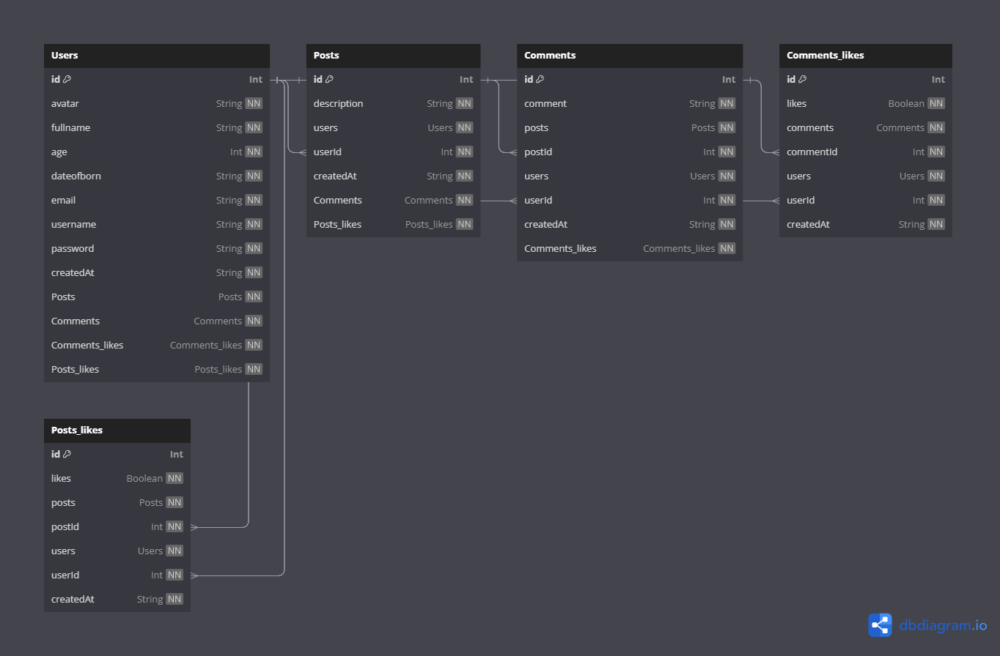

# prueba-tecnica

[[repositorio](https://github.com/saturnavt/prueba-tecnica)](https://github.com/saturnavt/prueba-tecnica)

## Instalación

Descarga nodejs [nodejs] (https://nodejs.org/es/).

Utilice el administrador de paquetes [npm] (https://www.npmjs.com/) para instalar las dependencias.

## Primero las dependencias del back (NestJs)
Ingresamos a la carpeta /back y ejecutamos los siguientes comando
```prisma
# Esto instala las dependencias
npm install

# Esto genera el schema de prisma
npx prisma migrate dev --schema src/prisma/schema.prisma
npx prisma generate --schema src/prisma/schema.prisma

# Y por ultimo corremos el back
npm run start:dev
```
## El back tiene las siguientes Rest Apis

- Users
- Posts
- Post Likes
- Comments
- Comments Likes


# Swagger Documentación del back
[Swagger](http://localhost:3001/api) http://localhost:3001/api

## Segundo las dependencias del front (NextJs)
Ingresamos a la carpeta /front y ejecutamos los siguientes comando
```prisma
# Esto instala las dependencias
npm install

# Y por ultimo corremos el front
yarn dev

# Si da algun error de react app intentar instalar el siguiente paquete y volver a correr la app
npm install create-react-app
```
## El front tiene los siguientes módulos

- Login
- Registro
- Publicaciones (Aca podras hacer una publicación y ver publicaciones de otros usuarios, tambien podras dar me gusta a una publicación y sera agregadaa las publicaciones que te gustan y tambien puedes comentar estas publicaciones dano click en el icono de comentario)
- Perfil (Aca podras ver tus publicaciones, publicaciones que te gustan y tambien podras modificar tu perfil como ( Foto de perfil, correo etc... ))

# El front corre en la siguiente url
[http://localhost:3000](http://localhost:3000)

# Se uso Clean Architecture  para la arquitectura del back [https://blog.cleancoder.com/uncle-bob/2012/08/13/the-clean-architecture.html](https://blog.cleancoder.com/uncle-bob/2012/08/13/the-clean-architecture.html)


## La base de datos que se usa es sqlite (Se usa SQLite para simplicidad usando el ORM [PRISMA](https://www.prisma.io))

Diagrama de base de datos


Si quieres ver la base de datos te recomiendo descargar la siquiete app
(https://sqlitestudio.pl/)

Al descargar la app y ejecutarla podras darle en cargar archivo y podrias encontrar el archivo de sqlite dentro de la carpeta /back/src/prisma
el archivo se llama dev.db

## Por falta de tiempo y complejidad de la prueba no se alcanso a hacer los siguientes requerimientos

1. Recuperar contraseña
2. Notificacion por correo
3. Docker
4. Solo se hicieron algunos test unitarios del back los cuales se pueden probar ingresando a la carpeta del back y ejecutando en consola los siguiente comandos
- yarn test src/utils/services/bcrypt/bcrypt.service.spec.ts -t
- yarn test src/utils/services/jwt/jwt.service.spec.ts -t


## Contribuyendo

Las solicitudes de extracción son bienvenidas. Para cambios importantes, abra un problema primero para discutir qué le gustaría cambiar.

Asegúrese de actualizar las pruebas según corresponda.

## License
[MIT](https://choosealicense.com/licenses/mit/)